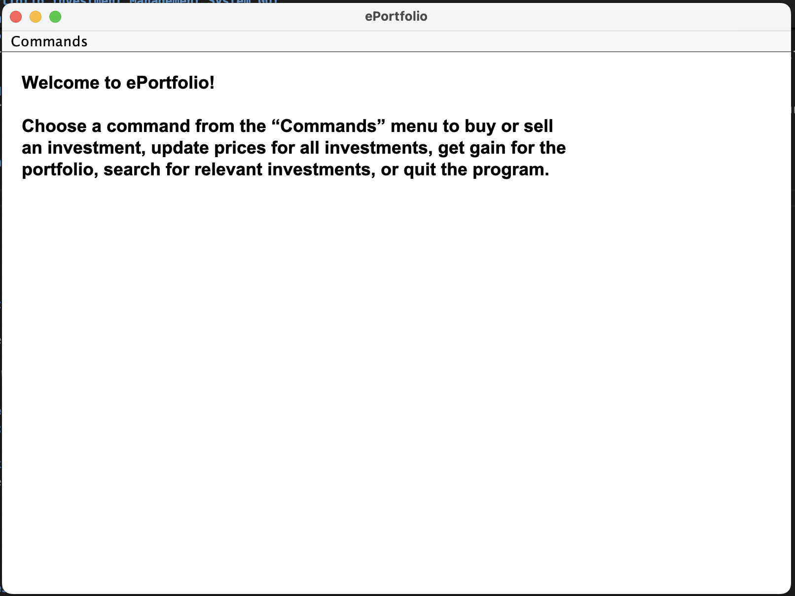
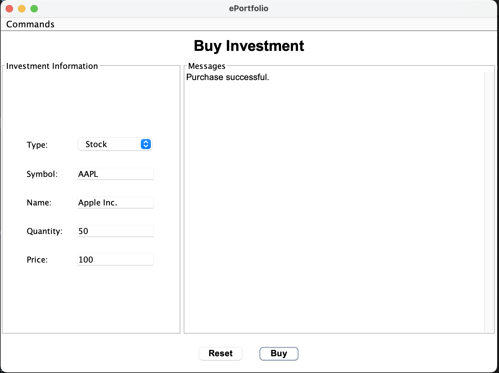
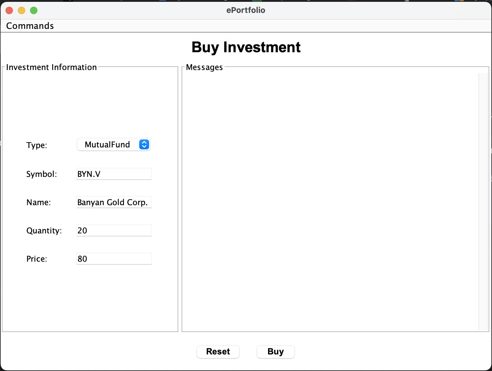
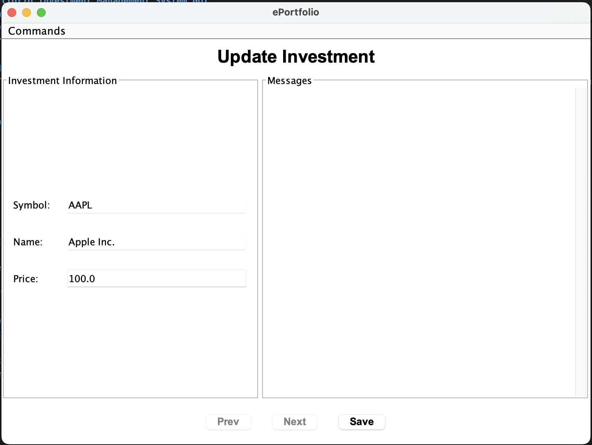
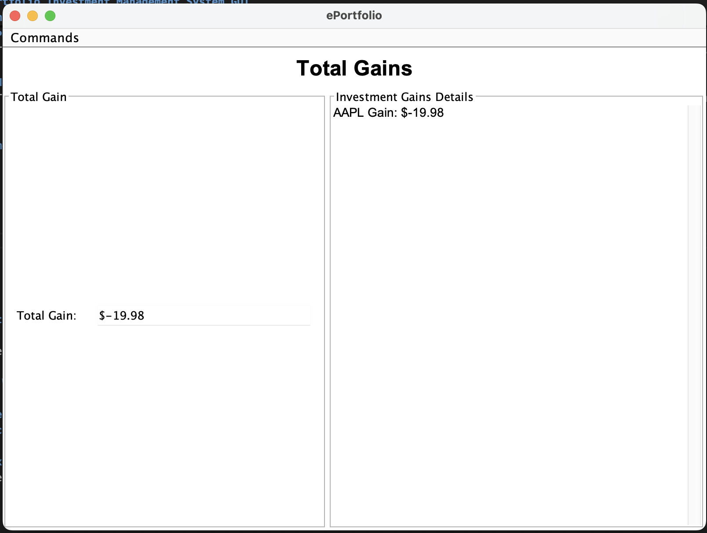
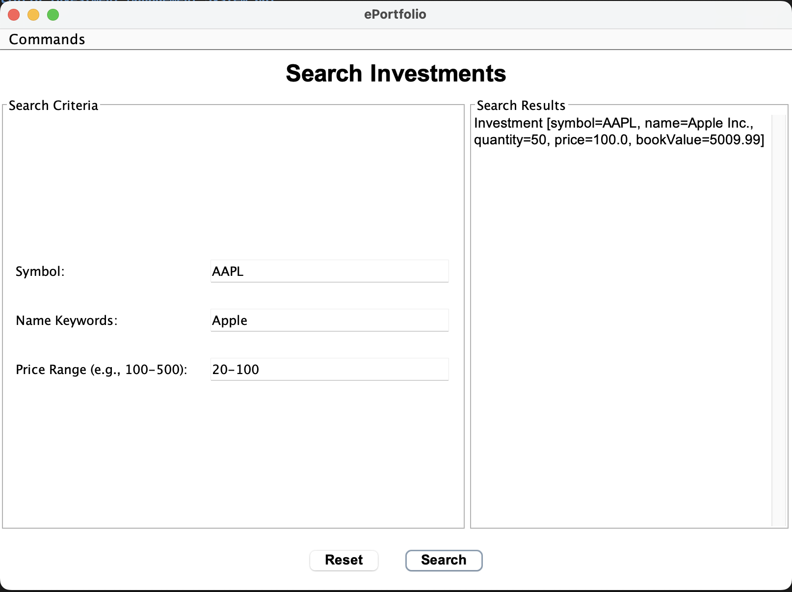

# ePortfolio Investment Management System GUI

---

## Project Overview

This project implements an enhanced investment portfolio system with a **Graphical User Interface (GUI)**. Users can easily manage their investments, including stocks and mutual funds, through an intuitive and interactive GUI.

### Key Features:
- **GUI-based interaction**: A clean and modern graphical interface for seamless user experience.
- **Buy and sell investments**: Purchase and sell stocks and mutual funds using dedicated forms.
- **Update prices of investments**: Update investment prices with a simple navigation mechanism.
- **Calculate total portfolio gain**: View the total gain of the portfolio at any time.
- **Search for investments**: Perform searches based on investment symbol, name keywords, and price range.
- **Real-time feedback**: Messages for success, error, or invalid inputs are displayed interactively.
- **Load and save functionality**: Investments are automatically loaded from a file on startup and saved upon exiting.
- **Efficient searching**: A `HashMap` is used for indexing investment names to enable faster searches.

---

## GUI Overview

The program now features a GUI for better usability, implemented using **Java Swing**. Key interface updates include:

### 1. Welcome Screen
- A centered welcome message introducing the program's functionality.
- Provides instructions for navigating the interface via the menu bar.

### 2. Buy Interface
- A dedicated form for entering details of investments to purchase, including type, symbol, name, quantity, and price.
- Real-time validation of inputs and feedback messages.

### 3. Sell Interface
- A simple form to sell investments by entering symbol, quantity, and price.
- Automatically checks if the user owns sufficient quantity to sell.

### 4. Update Interface
- Navigate between investments using "Prev" and "Next" buttons.
- Update investment prices individually with instant validation.

### 5. Get Gain Interface
- Displays the total gain of the portfolio at the top.
- Shows detailed gains for individual investments in a scrollable text area.

### 6. Search Interface
- Allows users to search for investments using symbol, name keywords, or price range.
- Displays matching results in a detailed and scrollable message area.

---

## Project Structure

The structure remains consistent with the previous versions but now includes GUI-related updates. Ensure you are in the `rako_a3` directory before compiling and running.

```
rako_a3/
│
├── ePortfolio/
│   ├── bin/                        # Compiled files (.class files)
│   ├── src/                        # Source files for GUI and backend
│   │   ├── Main.java               # Entry point of the program
│   │   ├── EPortfolioGUI.java      # GUI implementation using Java Swing
│   │   ├── Portfolio.java          # Core logic for managing the portfolio
│   │   ├── Investment.java         # Superclass for Stock and MutualFund
│   │   ├── Stock.java              # Implementation of Stock investments
│   │   └── MutualFund.java         # Implementation of Mutual Fund investments
│   ├── docs/                       # JavaDoc documentation
│                              
│
└── README.md                       # Updated README file                              
│
└── JAR file
│
└── investments.txt                 # File for loading/saving portfolio data      
             
```

---

## How to Compile and Run the Program?

### Compilation Instructions:

1. **Navigate to the project directory**:

   ```
   cd rako_a3
   ```

2. **Compile the source code**:

   ```
   javac -d ePortfolio/bin ePortfolio/src/*.java
   ```

   - This command compiles all Java files in the `src` folder and outputs the `.class` files to the `bin` directory.

### Running the Program

1. **Run the program**:

   ```
   java -cp ePortfolio/bin rako_a3.ePortfolio.src.Main investments.txt
   ```


## Some screenshots of the GUI
---

---

---

---

---

---


---


### Some reference commands

1. **Remove Class Files from Bin**:

   ```
   rm -rf ePortfolio/bin/*
   ```

2. **Make a jar file**

    ```
    jar cf ePortfolio.jar *
    ```

3. **Make javadoc**

    ```
    javadoc -d ../docs *.java   
    ```

---


## GUI Navigation

1. Use the **menu bar** at the top to access different interfaces:
   - **Buy**: To purchase new investments.
   - **Sell**: To sell existing investments.
   - **Update**: To update investment prices.
   - **Get Gain**: To calculate total gains.
   - **Search**: To find investments matching specific criteria.
   - **Quit**: To save changes and exit.

2. Each interface is designed for clarity and ease of use, with real-time feedback for inputs.


Here’s how you can update the **README.md** file to include **Assumptions** and **Limitations** for your project. These sections help set expectations for users about how the program works and where it might have restrictions.

---

## Assumptions

1. **Investment Types**:
   - The program assumes there are only two types of investments: `Stock` and `MutualFund`.
   - Any input outside these two types will result in an error.

2. **File Format**:
   - The program assumes the input file (`investments.txt`) exists and follows the specified format for loading investments. 
   - Each investment is represented with attributes like `Symbol`, `Name`, `Quantity`, `Price`, and `Book Value`.

3. **User Input**:
   - Users will input valid and properly formatted data where required.
   - For example:
     - Numeric fields like `Price` and `Quantity` should not contain alphabetic characters.
     - `Price Range` for searches must follow the format `lowPrice-highPrice` (e.g., `100-500`).

4. **Unique Symbols**:
   - Each investment is uniquely identified by its symbol. There are no duplicate symbols in the portfolio.

5. **Case-Insensitive Commands**:
   - Commands entered in the GUI or console (e.g., `Buy`, `SELL`, `search`) are case-insensitive.

---

## Limitations

1. **Data Validation**:
   - The program performs basic input validation but does not handle all edge cases. For example:
     - Invalid or partial price ranges in the search interface may still cause errors.
     - Extremely large or unrealistic values (e.g., quantity = 1,000,000,000) might result in unexpected behavior.

2. **Error Handling**:
   - Error messages are displayed in the GUI's `Messages` area, but they do not provide detailed debugging information.
   - Users must manually correct errors and reattempt actions.

3. **File Persistence**:
   - The program overwrites the `investments.txt` file every time the portfolio is saved. There is no versioning or backup of previous data.

4. **Single User**:
   - The system is designed for single-user operation and does not support concurrent access or multi-user functionality.

5. **Search Constraints**:
   - The `Search` functionality does not support complex queries or advanced filters.
   - Only simple keyword matching and basic price range filtering are available.

6. **GUI Limitations**:
   - The program's GUI is designed for simplicity and does not include advanced styling or customization options.
   - The GUI assumes standard screen resolutions. It may not adapt well to extremely small or large screens.

7. **Investment Types Are Hardcoded**:
   - The investment types (`Stock` and `MutualFund`) are fixed and cannot be dynamically extended by the user without modifying the source code.

8. **Performance**:
   - The program has not been optimized for large datasets. Portfolios with thousands of investments may experience slow performance.

9. **No Internationalization**:
   - The program supports only English and does not provide support for other languages or regional formats (e.g., currency formats).

---

# Test Plan for ePortfolio GUI

The test plan has been updated to include GUI-related functionality.

## 1. Welcome Screen

### Test Case 1.1: Displaying the Welcome Screen
**Description**: Verify that the welcome screen is displayed upon startup with appropriate instructions.

- **Expected Output**: 
  - Welcome message centered and instructions displayed.

---

## 2. Buy Interface

### Test Case 2.1: Valid Investment Purchase
**Description**: Test buying a valid investment via the GUI.

- **Inputs**:
  - Type: Stock
  - Symbol: AAPL
  - Name: Apple Inc.
  - Quantity: 100
  - Price: 150.00
- **Expected Output**: 
  - Confirmation message: "Purchase successful."

---

## 3. Sell Interface

### Test Case 3.1: Valid Investment Sale
**Description**: Test selling a portion of an investment via the GUI.

- **Inputs**:
  - Symbol: AAPL
  - Quantity: 50
  - Price: 160.00
- **Expected Output**: 
  - Confirmation message: "Sale successful. Payment received."

---

## 4. Update Interface

### Test Case 4.1: Navigating Investments
**Description**: Test navigating between investments using "Prev" and "Next" buttons.

- **Expected Output**: 
  - Investment details update correctly as buttons are clicked.

---

## 5. Get Gain Interface

### Test Case 5.1: Displaying Total Gain
**Description**: Test the calculation and display of total portfolio gain.

- **Expected Output**: 
  - Correct total gain displayed in the text field.

---

## 6. Search Interface

### Test Case 6.1: Valid Search
**Description**: Test searching for investments with valid criteria.

- **Inputs**:
  - Symbol: AAPL
  - Keywords: Apple
  - Price Range: 100-200
- **Expected Output**: 
  - Displays matching investments in the results area.

### Test Case 6.2: Invalid Price Range
**Description**: Test entering an invalid price range.

- **Inputs**:
  - Price Range: -100-50
- **Expected Output**: 
  - Error message: "Invalid price range format."

---